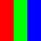
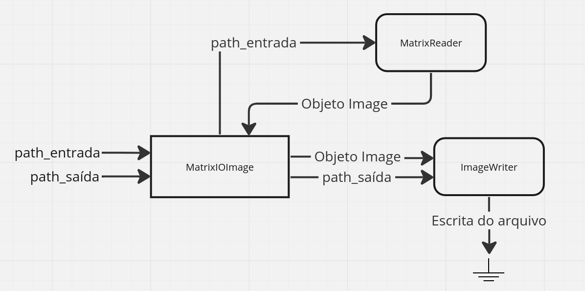
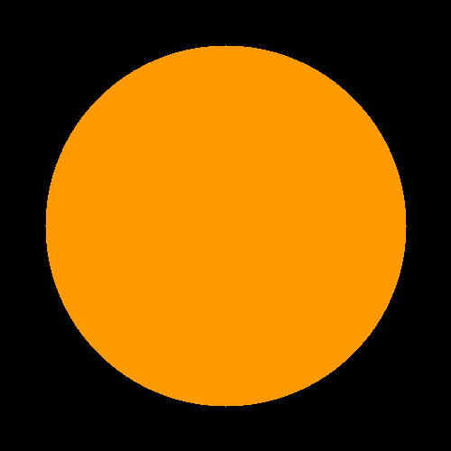
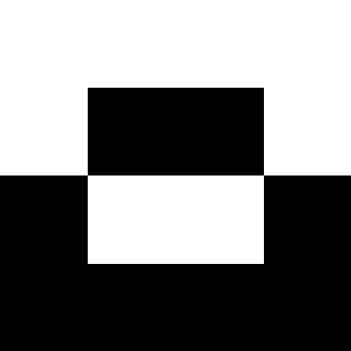

# Matrix I/O Image

## Visão Geral

Esta atividade tem como objetivo a implementação de uma classe que permita a leitura de matrizes em um arquivo texto com um formato pré-definido e o converta para algum formato de imagem, como [PNG](https://www.adobe.com/br/creativecloud/file-types/image/raster/png-file.html).

Documentação do código gerada pelo Doxygen: [https://guilherme-fumagali.github.io/curso-computacao-grafica/Atividade%201/docs/html/index.html](https://guilherme-fumagali.github.io/curso-computacao-grafica/Atividade%201/docs/html/index.html)

## Formato da Matriz de Entrada

Na primeira linha do arquivo de entrada, deve haver dois números inteiros separados por espaço, que representam a quantidade de linhas e colunas da matriz, respectivamente. Nas linhas seguintes, deve haver uma sequência de números inteiros separados por espaço, que representam os valores de cada pixel da matriz, da esquerda para a direita e de cima para baixo.

Os valores dos pixels são descritos por três números inteiros, que representam os valores de vermelho, verde e azul, respectivamente. Os valores de cada pixel devem estar entre 0 e 255, inclusive. 

Abaixo, há um exemplo de I/O:

| Matriz de entrada | Imagem de saída |
|:-----------------:|:---------------:|
|3 3<br>255 0 0 0 255 0 0 0 255<br>255 0 0 0 255 0 0 0 255<br>255 0 0 0 255 0 0 0 255 |  |

## Arquitetura da Aplicação

A aplicação foi implmentada em C++ com o auxílio da biblioteca [ImageMagick](https://imagemagick.org/index.php), para codificação das imagens.

A interface do conversor é definida pela classe [`MatrixIOImage`](src/MatrixIOImage.hpp), que recebe no construtor o nome do arquivo de entrada e o nome do arquivo de saída, e possui métodos para conversão da matriz para imagem em diferentes formatos.

#### Módulos

Para realizar a conversão da matriz para imagem, a classe `MatrixIOImage` utiliza dois módulos:

- ['MatrixReader'](src/modules/MatrixReader.hpp): responsável por ler o arquivo de entrada e o converter para o formato [`Image`](https://imagemagick.org/api/Image++.php) da biblioteca ImageMagick.
- ['ImageWriter'](src/modules/ImageWriter.hpp): responsável por escrever o arquivo de saída a partir de um objeto do tipo [`Image`](https://imagemagick.org/api/Image++.php) da biblioteca ImageMagick.

Dessa forma, o fluxo de execução da aplicação é ilustrado pelo diagrama abaixo:



A abordagem em módulos possibilita a extensão da aplicação para outros formatos de entrada e saída, sem a necessidade de alterar a classe `MatrixIOImage`.  Assim, caso seja necessário ler um formato hexadecimal ao invés de decimal, na matriz de entrada, basta criar um novo módulo que implemente a interface `MatrixReader` com um novo método `readFromFile`, que leia o arquivo de entrada e o converta para um objeto do tipo `Image`. O mesmo vale para o módulo `ImageWriter`, onde por exemplo pode ser implementado métodos que realizem algum tipo de tratamento na imagem antes de escrevê-la no arquivo de saída.

Atualmente, o módulo `ImageWriter` possibilita a escrita em qualquer formato suportado pela biblioteca ImageMagick, porém, para a leitura, foi implementado apenas o módulo `MatrixReader`, que lê arquivos no formato descrito na seção [Formato da Matriz de Entrada](#formato-da-matriz-de-entrada).

## Compilação

#### Dependências

- [gcc](https://gcc.gnu.org/), compilador C++.
- [ImageMagick](https://imagemagick.org/index.php), biblioteca para codificação de imagens.
- [Doxygen](https://www.doxygen.nl/index.html), ferramenta para geração de documentação.

#### Compilando

Para compilar classe `MatrixIOImage`, junto aos módulos `MatrixReader` e `ImageWriter` e ao programa principal, basta executar o comando abaixo:

```bash
make all
``` 

Os arquivos compilados serão gerados na pasta `build`.

#### Gerando documentação

Para gerar a documentação do código, execute o comando abaixo:

```bash
make docs
```

A documentação será gerada na pasta `docs`.

## Execução

Para executar o programa, basta executar o comando abaixo:

```bash
./build/main <input_file> <output_file>
```

Onde `<input_file>` é o nome do arquivo que contém a matriz de entrada e `<output_file>` é o nome do arquivo de saída que conterá a imagem gerada.

É válido ressaltar que o formato do arquivo de saída é definido pela extensão do nome do arquivo. Por exemplo, se o nome do arquivo de saída for `image.png`, a imagem gerada será no formato PNG.

## Testes

No diretório [`utils`](src/utils/) há códigos fonte que podem ser utilizados para gerar diferentes matrizes de entrada para testar a classe conversora. 

Os arquivos gerados pelos códigos se encontram no diretório [`static/tests`](static/tests/). Mas, caso deseje executar os códigos fonte, é necessário compilar os mesmos.

#### Compilando os códigos fonte

Para compilar, dentro do diretório [`utils`](src/utils/), execute o comando abaixo:

```bash
make all
```

Os arquivos compilados serão gerados na mesma pasta, com o mesmo nome do arquivo fonte, porém sem a extensão `.cpp`. Comum a ambos os códiggos, há uma parâmetro de linha de comando que define o nome do arquivo de saída.

### Imagens geradas

Foram implementados três códigos geradores de matrizes de entrada, um que gera um degradê, outro que gera um círculo e outro que gera um quadrado. Abaixo é mostrado os PNGs gerados após a conversão das matrizes geradas pelos códigos fonte.

| Degradê | Círculo | Quadrado |
|:-------:|:-------:|:--------:|
|  |  |  |