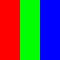
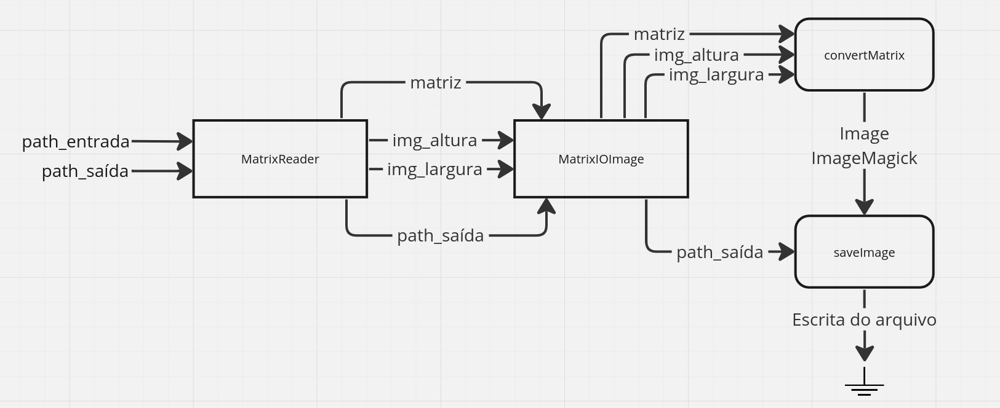
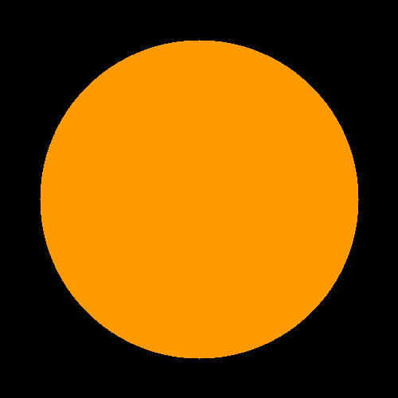
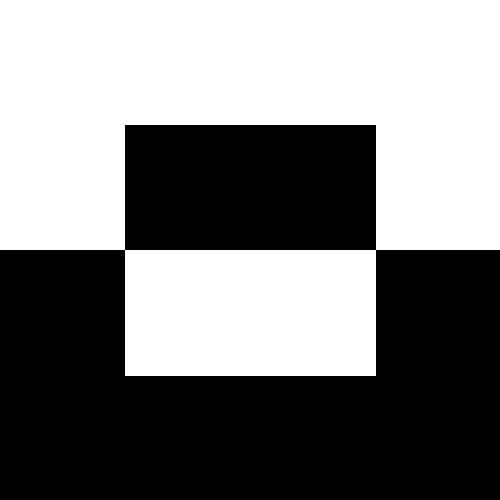

# Matrix I/O Image

## Visão Geral

Esta atividade visa a implementação de uma classe que receba como entrada uma matriz com um formato pré-definido e o converta para algum formato de imagem, como [PNG](https://www.adobe.com/br/creativecloud/file-types/image/raster/png-file.html).

Documentação do código gerada pelo Doxygen: [https://guilherme-fumagali.github.io/curso-computacao-grafica/Atividade_1/docs/html/index.html](https://guilherme-fumagali.github.io/curso-computacao-grafica/Atividade%201/docs/html/index.html)

## Formato da Matriz de Entrada

A matriz é formada por 'M' linhas e 'N' colunas com valores inteiros entre 0 e 255.

Cada três valores inteiros representam um pixel da imagem, onde o primeiro valor é o canal vermelho, o segundo o canal verde e o terceiro o canal azul.

Dessa forma, para gerar uma imagem de 500 pixels de largura por 500 pixels de altura, a matriz de entrada deve ter 500 linhas e 1500 colunas, visto que cada pixel é representado por três valores inteiros.

Abaixo, há um exemplo de matriz de entrada e a imagem gerada a partir da mesma.

|                               Matriz de entrada                               | Imagem de saída |
|:-----------------------------------------------------------------------------:|:---------------:|
| 255 0 0 0 255 0 0 0 255<br>255 0 0 0 255 0 0 0 255<br>255 0 0 0 255 0 0 0 255 |  |

## Arquitetura da Aplicação

A aplicação foi implementada em C++ com o auxílio da biblioteca [ImageMagick](https://imagemagick.org/index.php), para codificação das imagens.

A interface do conversor é definida pela classe [`MatrixIOImage`](./src/main.hpp), que recebe como entrada a matriz e a converte para uma imagem, que é escrita em um arquivo de saída.

#### Métodos

Para realizar a conversão da matriz para imagem, a classe `MatrixIOImage` utiliza dois módulos:

- `convertMatrix`: responsável por iterar sobre a matriz de entrada e gerar um objeto do tipo [`Image`](https://imagemagick.org/api/Image++.php) da biblioteca ImageMagick.
- `saveImage`: responsável por escrever o arquivo de saída a partir de um objeto do tipo [`Image`](https://imagemagick.org/api/Image++.php) da biblioteca ImageMagick.

#### Leitura da matriz de entrada a partir de um arquivo

Com viés de testes, no arquivo [`main.cpp`](./src/main.cpp) há um código que lê a matriz de entrada a partir de um arquivo e a converte para uma imagem, escrita em um arquivo de saída.


Dessa forma, o fluxo de execução da aplicação é ilustrado pelo diagrama abaixo:



A abordagem dos métodos possibilita a extensão da aplicação para outros formatos de entrada e saída, sem a necessidade de alterar a interface da classe `MatrixIOImage`. Assim, caso seja necessário ler uma matriz em formato hexadecimal ao invés de decimal, basta criar um novo código-fonte que implemente a interface com um novo método `convertMatrix`, que leia uma matriz de strings e a converta para um objeto do tipo `Image`. O mesmo vale para o método `saveImage`, onde, por exemplo, pode ser implementada lógicas que realizem algum tipo de tratamento na imagem antes de escrevê-la no arquivo de saída.

Atualmente, o método `saveImage` possibilita a escrita em qualquer formato suportado pela biblioteca ImageMagick, porém, para a leitura, o método `convertMatrix` lê somente matrizes no formato descrito na seção [Formato da Matriz de Entrada](#formato-da-matriz-de-entrada).

## Compilação

#### Dependências

- [gcc](https://gcc.gnu.org/), compilador C++.
- [CMake](https://cmake.org/), ferramenta para geração de arquivos de compilação.
- [Doxygen](https://www.doxygen.nl/index.html), ferramenta para geração de documentação.

#### Compilando

Para compilar todos os códigos fonte com CMake, execute o comando abaixo:

```bash
cmake -B build CMakeLists.txt && cmake --build build
``` 

Os arquivos compilados serão gerados na pasta `./build`.

#### Gerando documentação

Para gerar a documentação do código, execute o comando abaixo:

```bash
doxygen Doxyfile
```

A documentação será gerada na pasta `./docs`.

## Execução

Para executar o programa que lê a matriz de entrada a partir de um arquivo e a converte para uma imagem, execute o comando abaixo:

```bash
./build/src/main <input_file> <output_file>
```

Onde `<input_file>` é o nome do arquivo que contém a matriz de entrada e `<output_file>` é o nome do arquivo de saída que conterá a imagem gerada.

É válido ressaltar que o formato do arquivo de saída é definido pela extensão do nome do arquivo. Por exemplo, se o nome do arquivo de saída for `image.png`, a imagem gerada será no formato PNG.

## Testes

No diretório [`utils`](./src/utils/) há códigos fonte que podem ser utilizados para gerar diferentes matrizes de entrada para testar a classe conversora. 

Os arquivos gerados pelos códigos se encontram no diretório [`static/tests`](./static/tests/). Mas, caso deseje executar os códigos fonte, execute o comando abaixo:

```bash
./build/src/utils/generate_circle <output_file>
```

```bash
./build/src/utils/generate_gradient <output_file>
```

```bash
./build/src/utils/generate_two_colors_square <output_file>
```

### Imagens geradas

Foram implementados três códigos geradores de matrizes de entrada, um que gera um degradê, outro que gera um círculo e outro que gera um quadrado. Abaixo é mostrado os PNGs gerados após a conversão das matrizes geradas pelos códigos fonte.

| Degradê | Círculo | Quadrado |
|:-------:|:-------:|:--------:|
|  |  |  |