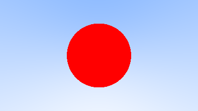
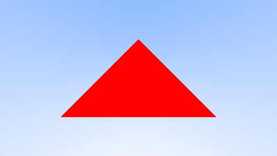
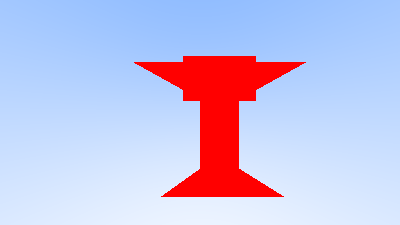

# Visualização inicial

## Visão geral

Essa atividade consiste em implementar uma visualização de uma esfera, um triangulo, e um objeto 3D definido por um arquivo .obj. A visualização é feita com algoritmo de ray-tracing.

Consulte a documentação do código-fonte para mais detalhes sobre as classes e as funções implementadas: https://guilherme-fumagali.github.io/curso-computacao-grafica/Atividade_4/docs/html/index.html

## Implementação

Foram implementados um código-fonte em C++ para cada uma das visualizações.

Para encapsular a lógica de cada forma geométrica, foram criadas as classes [HittableSphere](./src/headers/HittableSphere.h) e [HittableTriangle](./src/headers/HittableTriangle.h), que implementam a interface [Hittable](./src/headers/Hittable.h). A classe Hittable é responsável por definir a interface que deve ser implementada por qualquer forma geométrica que possa ser atingida por um raio.

Com isso, os códigos-fonte:

- [sphere.cpp](./src/sphere.cpp): implementa a visualização de uma esfera usando [HittableSphere](./src/headers/HittableSphere.h).
- [triangle.cpp](./src/triangle.cpp): implementa a visualização de um triângulo usando [HittableTriangle](./src/headers/HittableTriangle.h).
- [obj_render.cpp](./src/obj_render.cpp): implementa a visualização de um objeto 3D definido por um arquivo .obj usando [HittableTriangle](./src/headers/HittableTriangle.h), o leitor de .obj [Loader.h](../Atividade_3/src/Loader.h), e o conversor de imagens [MatrixIOImage.hpp](../Atividade_1/src/MatrixIOImage.hpp).

Abaixo há as imagens geradas por cada uma das implementações.

|                         Esfera                         |                        Triângulo                         |          [.obj](./src/static/obj/piston_cup_trophy.obj)           |
|:------------------------------------------------------:|:--------------------------------------------------------:|:-----------------------------------------------------------------:|
|  |  |  |

### Viewport e Câmera

Em todas as implementações, o viewport, ou janela de visualização, é definida com uma altura de 2 unidades em um uma proporção de 16:9, resultando em uma largura aproximada de 3.56 unidades.
 
A câmera, nas implementações estáticas `sphere.cpp` e `triangle.cpp`, é definida com uma posição inicial de (0, 0, 0), um ponto de foco em (0, 0, -1). Por outro lado, na implementação dinâmica `obj_render.cpp`, a câmera é definida com uma posição inicial de (0, 0, 1), capturando assim todo viewport.

## Compilação e execução

#### Dependências

- [gcc](https://gcc.gnu.org/), compilador C++.
- [CMake](https://cmake.org/), ferramenta para geração de arquivos de compilação.
- [Doxygen](https://www.doxygen.nl/index.html), ferramenta para geração de documentação.

Compile o código-fonte com o comando abaixo:

```bash 
cmake -B build CMakeLists.txt && cmake --build build
```

Os arquivos compilados serão gerados na pasta `./build`.

#### Gerando documentação

Para gerar a documentação do código, execute o comando abaixo:

```bash
doxygen Doxyfile
```

A documentação será gerada na pasta `./docs`.

### Executando

Para executar o código, execute o comando abaixo:

<b>Esfera</b>

```bash
./build/sphere
```

<b>Triângulo</b>

```bash
./build/triangle
```

<b>Objeto 3D</b>

```bash
./build/obj_render <path_to_obj_file> <path_to_output_image>
```

Caso a extensão do arquivo de saída seja omitido, a imagem será salva com a extensão `.png`.

