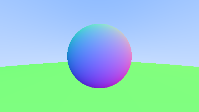
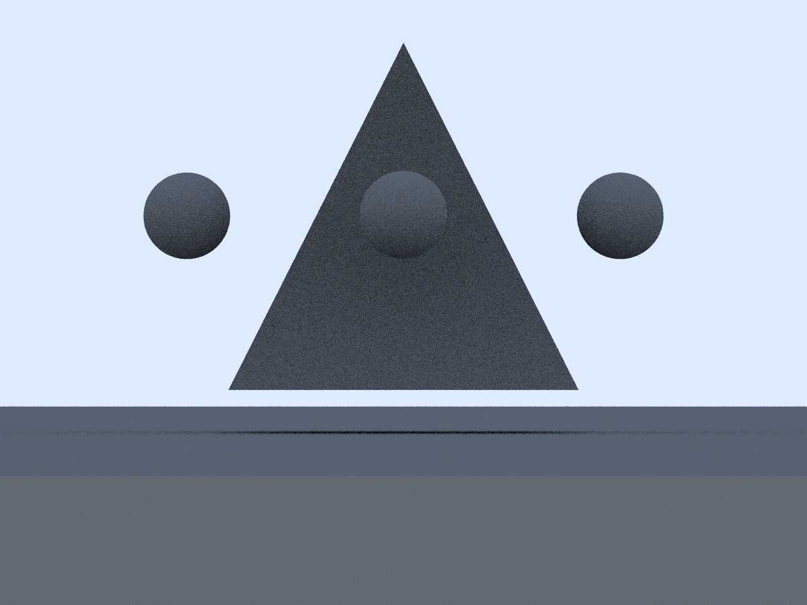
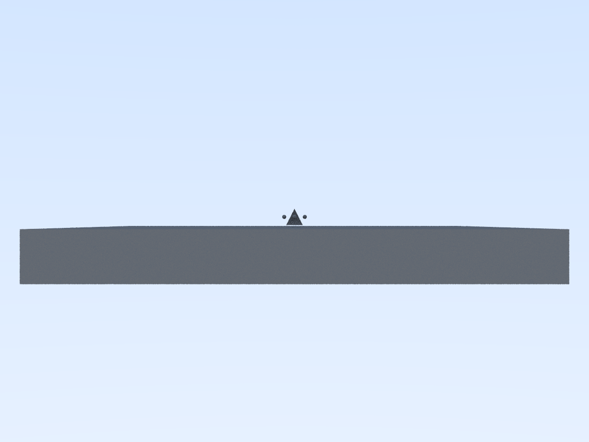
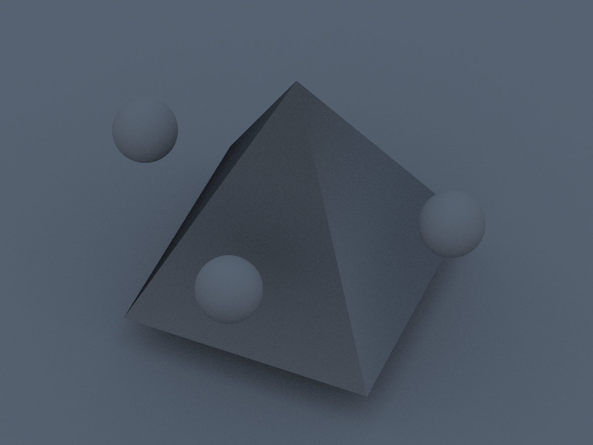

# Materiais difusos

O objeto dessa atividade é seguir as seções 6, 7, 8, 9 e 12 do [tutorial](https://raytracing.github.io/books/RayTracingInOneWeekend.html#diffusematerials) para implementar um material difuso, que utilize a normal do modelo para os saltos do raio.

Em seguida, deve-se criar uma visualização de cena com pelo menos três objetos, e com pelo menos duas posições de câmera diferentes.

Consulte a documentação do código-fonte para mais detalhes sobre as classes e as funções implementadas: https://guilherme-fumagali.github.io/curso-computacao-grafica/Atividade_5/docs/html/index.html

## Implementação

### Materiais difusos

A partir da seção 7 do [tutorial](https://raytracing.github.io/books/RayTracingInOneWeekend.html#diffusematerials), foi implementada incrementalmente várias classes de câmeras, estas mantidas no repositório e organizadas da seguinte forma:

| Nome do Arquivo                                                                   | Descrição                                                           |
|-----------------------------------------------------------------------------------|---------------------------------------------------------------------|
| [`camera.h`](src/headers/camera/camera.h)                                         | Renderiza uma cena dada uma lista de objetos e um tamanho de imagem |
| [`sampled_camera.h`](src/headers/camera/sampled_camera.h)                         | Implementação com amostragem de raios para antialiasing             |
| [`ray_bounced_sampled_camera.h`](src/headers/camera/ray_bounced_sampled_camera.h) | Cena com raios refletidos para uma imagem com objetos difusos       |
| [`view_direction_camera.h`](src/headers/camera/view_direction_camera.h)           | Implementação anterior com posição e direção da câmera definidas    |

Ademais, também foram mantidas todas as imagens geradas seguindo o tutorial:

| Imagem                                                                                 | Descrição                                                                                                                           | Código-fonte                                                                                   |
|----------------------------------------------------------------------------------------|-------------------------------------------------------------------------------------------------------------------------------------|------------------------------------------------------------------------------------------------|
|                       | Esfera com normais coloridas                                                                                                        | [`sphere_with_hittables_scene.cpp`](src/sphere_with_hittables_scene.cpp)                       |
|                        | Esfera com normais coloridas, do ponto de vista da [`camera.h`](src/headers/camera/camera.h)                                        | [`sphere_with_camera.cpp`](src/sphere_with_camera.cpp)                                         |
|                | Esfera com normais coloridas, do ponto de vista da [`sampled_camera.h`](src/headers/camera/sampled_camera.h)                        | [`sphere_with_sampled_camera.cpp`](src/sphere_with_sampled_camera.cpp)                         |
|    | Esfera com coloração difusa, do ponto de vista da [`ray_bounced_sampled_camera.h`](src/headers/camera/ray_bounced_sampled_camera.h) | [`sphere_with_ray_bounced_sampled_camera.cpp`](src/sphere_with_ray_bounced_sampled_camera.cpp) |
|  | Esferas com colorações difusas, do ponto de vista da [`view_direction_camera.h`](src/headers/camera/view_direction_camera.h)        | [`sphere_with_view_direction_camera.cpp`](src/sphere_with_view_direction_camera.cpp)           |

### Visualização de cena

Para a visualização de cena, foram importados os seguintes objetos:
    
- [Cube](src/static/objects/cube.obj)
- [Pyramid](src/static/objects/pyramid.obj)

A câmera utilizada foi a [`view_direction_camera.h`](src/headers/camera/view_direction_camera.h), em quatro diferentes configurações.

O código-fonte da visualização de cena pode ser encontrado em [`main.cpp`](src/main.cpp)

#### Resultados

A fim de experimentos, existem três configurações de "qualidade de imagem", que interferem no efeito de antialiasing e na difusão da luz:

| Configuração | Número de raios por pixel | Número de reflexões de raios |
|--------------|---------------------------|------------------------------|
| `low`        | 10                        | 5                            |
| `medium`     | 40                        | 20                           |
| `high`       | 100                       | 50                           |

E os resultados são:

| Qualidade | Posição de câmera 1                                                              | Posição de câmera 2                                                              | Posição de câmera 3                                                              | Posição de câmera 4                                                              |
|-----------|----------------------------------------------------------------------------------|----------------------------------------------------------------------------------|----------------------------------------------------------------------------------|----------------------------------------------------------------------------------|
| `low`     |     |     |     |     |
| `medium`  |  |  |  |  |
| `high`    |    |    |    |    |

## Compilação e execução

#### Dependências

- [gcc](https://gcc.gnu.org/), compilador C++.
- [CMake](https://cmake.org/), ferramenta para geração de arquivos de compilação.
- [Doxygen](https://www.doxygen.nl/index.html), ferramenta para geração de documentação.
- [ImageMagick](https://imagemagick.org/index.php), ferramenta para conversão de imagens.

Compile o código-fonte com o comando abaixo:

```bash 
cmake -B build CMakeLists.txt && cmake --build build
```

Os arquivos compilados serão gerados na pasta `./build`.

#### Gerando documentação

Para gerar a documentação do código, execute o comando abaixo:

```bash
doxygen Doxyfile
```

A documentação será gerada na pasta `./docs`.

### Executando

O único executável com parâmetros é o `main`, que recebe como parâmetros:

```bash
 ./build/main <camera position (0 at 3)> <quality ('l', 'm', 'h')>
```

sendo 'l' para `low`, 'm' para `medium` e 'h' para `high`.

Os artefatos de saída serão salvos no diretório raiz do projeto.