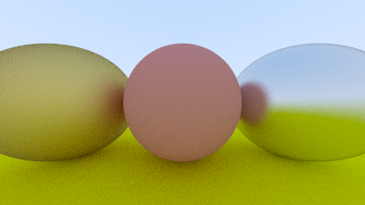
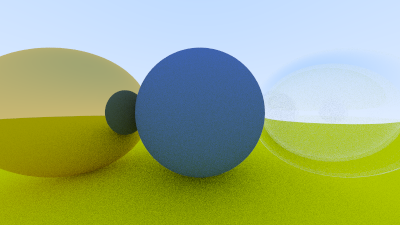
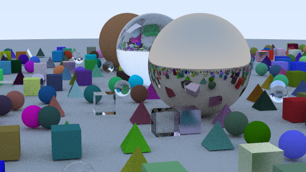

# Metal e vidro

O objeto dessa atividade é seguir as seções 10 e 11 do [tutorial](https://raytracing.github.io/books/RayTracingInOneWeekend.html#diffusematerials) para implementar os materiais com reflexão e refração.

Com isso, visualizar em seguida uma cena com um objeto metálico e outro de vidro.

Consulte a documentação do código-fonte para mais detalhes sobre as classes e as funções implementadas: https://guilherme-fumagali.github.io/curso-computacao-grafica/Atividade_6/docs/html/index.html

## Implementação

### Lambertian, metal e vidro
 
Ao longo da seção 10 do [tutorial](https://raytracing.github.io/books/RayTracingInOneWeekend.html#diffusematerials), é implementado na classe [`material.h`](src/headers/material.h) que define a interface para os materiais, que inclui a função `scatter` que calcula o espalhamento de um raio de luz em um objeto. Além de, neste mesmo arquivo, serem implementados os materiais `lambertian`, `metal` e `dielectric`.

#### Resultados

As imagens abaixo foram geradas com o código-fonte em:
- [`material_spheres.cpp`](src/material_spheres.cpp), que cria uma cena com três esferas, duas de material `metal` e uma de material `lambertian`;
- [`dialectrics_spheres.cpp`](src/dialectrics_spheres.cpp), que cria uma cena com três esferas, uma de material `dielectric`, uma de material `lambertian` e uma de material `metal`.


| `material_spheres.cpp`                                         | `dialectrics_spheres.cpp`                                        |
|----------------------------------------------------------------|------------------------------------------------------------------|
|  |  |

## Visualização de cena

Para a visualização de cena, foram importados os seguintes objetos:
    
- [Cube](src/static/objects/cube.obj)
- [Pyramid](src/static/objects/pyramid.obj)
- [Sphere](src/headers/hittable/HittableSphere.h)

O código-fonte da visualização de cena pode ser encontrado em [`main.cpp`](src/main.cpp), e consiste em uma geração aleatória de 484 objetos, sendo que:

- A probabilidade de um objeto ser um cubo, ou uma pirâmide, ou uma esfera é de 1/3 (33.3%);
- A probabilidade de um objeto ser lambertiano é 80%;
- A probabilidade de um objeto ser metálico é 15%;
- A probabilidade de um objeto ser de vidro é 5%.

#### Resultados

Foram feitas duas configurações de câmera, uma de menor qualidade para teste e outra de maior qualidade para visualização.

| Configuração | Tamanho da imagem | Número de raios por pixel | Número de reflexões de raios |
|--------------|-------------------|---------------------------|------------------------------|
| `low`        | 500               | 50                        | 5                            |
| `high`       | 1200              | 500                       | 50                           |

E os resultados são:

| Qualidade | Imagem                                                        |
|-----------|---------------------------------------------------------------|
| `low`     |    |
| `high`    |  |

## Compilação e execução

#### Dependências

- [gcc](https://gcc.gnu.org/), compilador C++.
- [CMake](https://cmake.org/), ferramenta para geração de arquivos de compilação.
- [Doxygen](https://www.doxygen.nl/index.html), ferramenta para geração de documentação.
- [ImageMagick](https://imagemagick.org/index.php), ferramenta para conversão de imagens.

Compile o código-fonte com o comando abaixo:

```bash 
cmake -B build CMakeLists.txt && cmake --build build
```

Os arquivos compilados serão gerados na pasta `./build`.

#### Gerando documentação

Para gerar a documentação do código, execute o comando abaixo:

```bash
doxygen Doxyfile
```

A documentação será gerada na pasta `./docs`.

### Executando

```bash
./build/material_spheres
./build/dialectrics_spheres
./build/main
```

Os artefatos de saída serão salvos no diretório raiz do projeto.